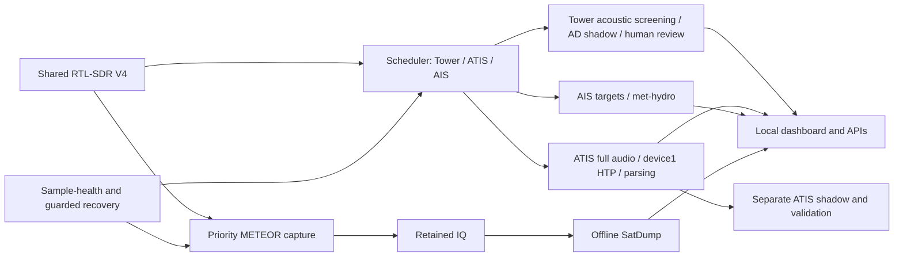

# RF-Watchkeeper on Dragonwing IQ-9075

RF-Watchkeeper combines scheduled aviation audio, dual-channel AIS, experimental METEOR weather-satellite imagery, RF sample-health monitoring and a local browser dashboard on a **Qualcomm Dragonwing IQ-9075 EVK**. Installation context is the approximate **Vaasa/Korsholm region, Finland**. The Arduino/Qualcomm showcase has been submitted for review; submission is not technical acceptance or an endorsement.

## Current status — inspected 10 October 2026

One RTL-SDR Blog V4 (`V4MAIN01`) is time-shared. METEOR reservations take priority. ARM64 Linux handles scheduling, demodulation, AIS, image decoding and Tower diagnostics; ATIS uses Qualcomm QNN HTP on the second compute DSP. Accelerator execution is evidenced, but reliable unattended full-pipeline operation is **not achieved**.

| Workload | Deployed behavior |
|---|---|
| Tower | 120.950 MHz AM; 15 s energy probes targeting 60 s starts, 10 s quiet tail, 75 s maximum; **07:00–23:00 Europe/Helsinki**. Acoustic screening and human review; **Tower ASR deferred** |
| ATIS | 136.450 MHz AM; 90 s every at least 600 s, all day. Full-message preparation, device1 HTP ASR, conservative parsing and consecutive-capture consensus; separate shadow/validation queues |
| AIS | AIS-catcher dual-channel reception; background chunks **up to 45 s**, shortened for due Airband work |
| METEOR | Autonomous planning/reserved capture, **256 kS/s**, 137.900 MHz, SatDump 1.2.2 ARM64/Docker and retained dashboard products; useful output can coexist with decoder SIGSEGV |
| 433 MHz | Historical Nexus-TH reception; optional second receiver remains disabled |

Periodic FM and the legacy satellite placeholder are disabled. Tower audio has a **30-day policy with permanent pins**; automatic satellite raw deletion remains disabled. Historical sample rates/results remain dated.

## Evidence and known limits

The corrected HTP path passed ten isolated runs and a scoped CPU/HTP/Tower demonstration. Its completed four-hour integrated observation **failed acceptance**: 23/24 verified ASR, 5/24 complete ASR+Genie results, 5.47 GiB retained DMA growth and 435 dashboard state timeouts. This does not support a whole-device utilization, power-efficiency or matched-speedup claim. [Definitive utilization evidence](docs/evk-utilization-status-20261009.md).

During the 10 October audit, the latest 12 retained ATIS outputs were `partial_success` with failed Genie interpretation; `/api/state` timed out once at 10 seconds while other inspected APIs returned 200. Tower backlog capacity, speech/numeric/Finnish accuracy, SatDump's underlying crash, fresh-device installation and real watchdog reboot acceptance remain open. Useful METEOR products and AIS reception are demonstrated observations, not guaranteed coverage. [Current audit and unresolved items](docs/current-status.md).

## Documentation

- [Current status and audit](docs/current-status.md), [architecture/data flow](docs/architecture.md), [hardware](docs/hardware.md)
- [Fresh installation and deployment updates](docs/installation.md), [services/operation](docs/operation.md), [SDR scheduling](docs/rf-jobs.md)
- [Airband/Tower capture](docs/airband.md), [Tower anomaly diagnostics](docs/tower-anomaly.md), [ATIS and shadow ASR](docs/atis.md)
- [AIS](docs/ais.md), [METEOR](docs/meteor.md), [433 MHz](docs/433mhz.md), [dashboard/APIs](docs/dashboard.md)
- [Retention](docs/data-retention.md), [recovery](docs/watchdog-and-recovery.md), [troubleshooting](docs/troubleshooting.md), [testing](docs/testing-and-validation.md)
- [Project history](docs/project-history.md), [engineering log](docs/project-log.md), [workflow](docs/workflow.md), [experiments](docs/experiments.md), [privacy](docs/location-privacy.md)

The repository exports application source and installed service snapshots, including the later deployed ASR/AD dependencies. It excludes models, native binaries, databases, recordings and private observer settings. A clone is not a turnkey EVK image. Read [AGENTS.md](AGENTS.md) and the workflow before engineering changes.

## Repository structure

| Location | Purpose |
| --- | --- |
| Root | README, agent instructions, Git settings; deployed Python, dashboard HTML, timezone data, job/health configuration and historical service snapshots |
| `docs/` | Current technical, installation, operations and project guides |
| `docs/legacy/` | Preserved ATIS/audio/METEOR/RF-health implementation guides; historical defaults do not override current guides |
| `docs/evidence/` | Dated validation reports and curated patches |
| `config/examples/` | Public observer configuration templates; copy to ignored root local configurations on a new installation |
| `scripts/` | Manual ASR audio preparation, saved-event display and Genie inventory helpers |
| `deploy/systemd/` | Reviewed installed unit/drop-in snapshots; preferred over historical root copies |
| `backends/` | Bundled scheduler backend |
| `static/` | Dashboard assets |

Run manual helpers from the application root: `python3 scripts/prepare_asr.py --help`, `python3 scripts/show_events.py --help`. `scripts/probe_genie.py` inventories native tools/models on the EVK; it is not an automatically scheduled workload.

Production files remain at root because effective EVK services, imports, external stages and relative runtime assets rely on that layout. A future `src/rf_watchkeeper/` migration requires an explicit packaging/deployment plan, complete import/path audit, staged Linux/ARM64 tests and affected live-service verification. Helpers with project-root assumptions, receiver benchmarks, migration registrars and runtime-imported modules also remain in place pending that audit. Existing EVK helper copies and runtime configurations are preserved; this cleanup deploys documentation only.
