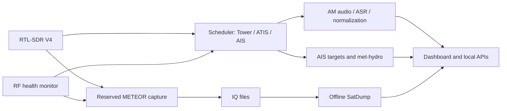

# RF-Watchkeeper

RF-Watchkeeper is a local RF monitoring project running on the **Qualcomm Dragonwing IQ-9075 EVK** with an RTL-SDR Blog V4 (`V4MAIN01`). It combines scheduled aviation audio, dual-channel AIS, experimental METEOR weather-satellite imagery, receiver health monitoring and a browser dashboard.

The EVK puts ARM64 Linux, containerized signal processing and Qualcomm ASR/Genie runtimes on one host. Compared with a conventional SBC, its value here is the opportunity to investigate local Qualcomm inference alongside RF processing. HTP/QNN is requested by the speech pipeline; measured accelerator placement, speed and power advantages remain **unverified**.

## Current status — 5 October 2026

| Workload | Deployed behavior |
| --- | --- |
| Vaasa Tower | 120.950 MHz AM; approximately 30 s every 3 min; 05:00–01:30 next day, Europe/Helsinki |
| Vaasa ATIS | 136.450 MHz AM; approximately 90 s every 10 min, all day; experimental text |
| AIS | Dual-channel AIS-catcher around 162 MHz; current background slots capped at 30 s |
| METEOR-M2 LRPT | Planner, V4 capture, SatDump 1.2.2 ARM64 decode and dashboard images; future managed captures **256 kS/s** |
| 433 MHz | Historical rtl_433 Nexus-TH reception; optional receiver currently disabled |

One V4 is shared. METEOR reservations take priority and ordinary slots can be delayed/skipped. Periodic FM reference reception is disabled. Current OS: Qualcomm Linux Reference Distro 2.0.

## Representative results

- Tower measured 29.184 s with a retained 185.706 s start interval; observed Tower examples were quiet. ATIS measured 89.088 s. [Airband validation](docs/evidence/airband-ops-20261005/report.md).
- Stored AIS records include Aurora Botnia and local base stations; [AIS Hydro timing](docs/ais-hydro-cadence.md) examines regional met/hydro observations.
- A weak experimental indoor METEOR capture produced 888/896/888 channel lines even though SatDump subsequently crashed; useful products and crash diagnostics are retained. [METEOR evidence](docs/meteor.md).

## Documentation

- [Architecture](docs/architecture.md), [hardware](docs/hardware.md), [installation](docs/installation.md)
- [Operation and services](docs/operation.md), [scheduler and RF jobs](docs/rf-jobs.md)
- [Airband](docs/airband.md), [ATIS](docs/atis.md), [AIS](docs/ais.md), [433 MHz](docs/433mhz.md), [METEOR](docs/meteor.md)
- [Dashboard/APIs](docs/dashboard.md), [watchdog/recovery](docs/watchdog-and-recovery.md)
- [Retention](docs/data-retention.md), [testing](docs/testing-and-validation.md), [troubleshooting](docs/troubleshooting.md)
- [Project history](docs/project-history.md), [engineering log](docs/project-log.md), [workflow](docs/workflow.md), [open experiments](docs/experiments.md)

## Limits and reproducibility

Indoor reception varies. Labelled Tower/ATIS accuracy, dependable numbers, Finnish recognition and accelerator profiling remain open. Optional Genie currently fails on retained runs; valid base transcripts remain available. SatDump's SIGSEGV is unresolved; partial-success classification preserves imagery rather than repairing the decoder. A real reboot acceptance test of the new watchdog remains outstanding.

The repository includes verified application source, a preserved scheduler dependency and installed service snapshots. Models, binaries, databases, recordings and machine-specific prerequisites are excluded. A fresh clone is not a turnkey EVK image; see [installation](docs/installation.md). The detailed chronological engineering log remains preserved.
